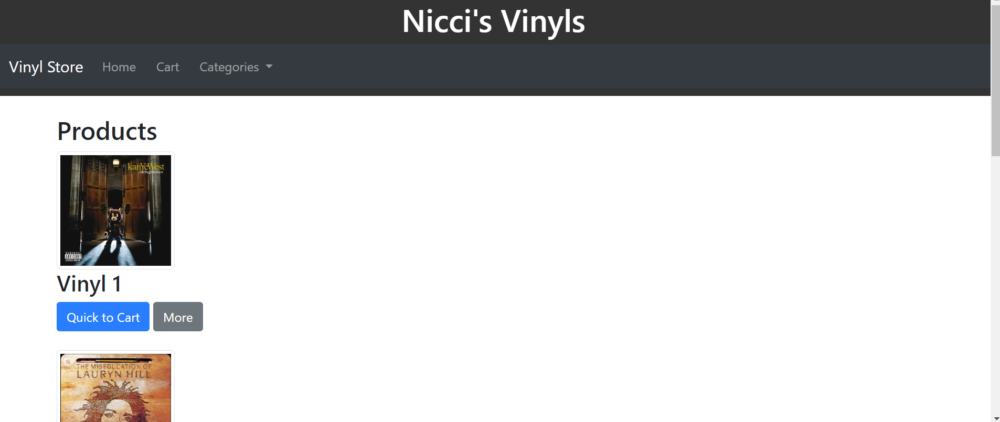
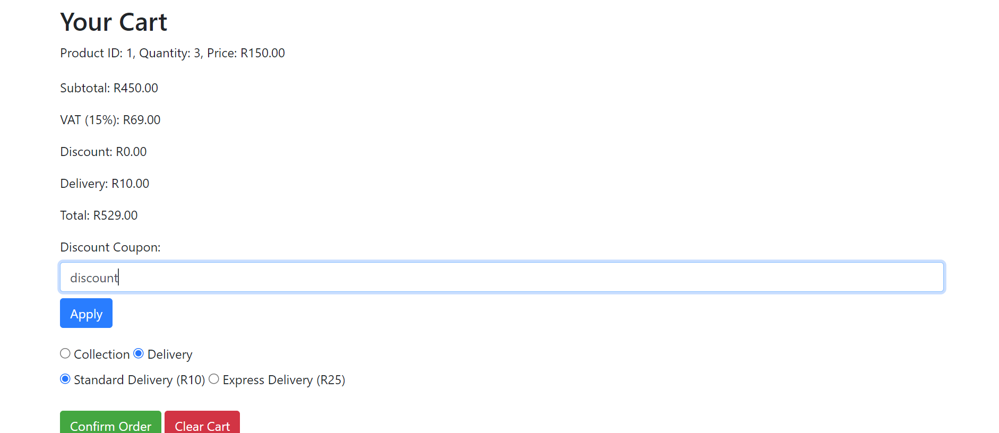

# My Online Store

## Project Description

My Online Store is a web application designed to provide an online platform for purchasing vinyl records. It allows users to browse products, add them to their cart, and manage their orders.

## Table of Contents

- [Project Description](#project-description)
- [Table of Contents](#table-of-contents)
- [Installation](#installation)
- [Usage](#usage)
- [Credits](#credits)

## Installation

To install this project locally, follow these steps:

1. Clone the repository:
    ```sh
    git clone https://github.com/safarimafia/MyOnlineStore.git
    ```
2. Navigate to the project directory:
    ```sh
    cd MyOnlineStore
    ```
3. Open the `index.html` file in your browser to view the homepage.

## Usage

After installing the project, you can start using it as follows:

1. Open the `index.html` file to view the homepage.
2. Browse the available vinyl records.
3. Click "Quick to Cart" to add items to your cart.
4. Navigate to the cart page to view and manage your cart.
5. Apply discount coupons and choose delivery options.
6. Confirm your order.

### Screenshots




## Credits

This project was created by safarimafia.
